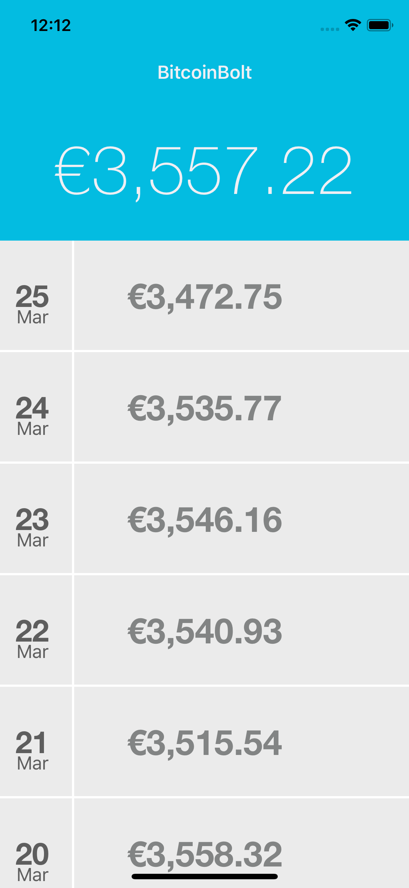
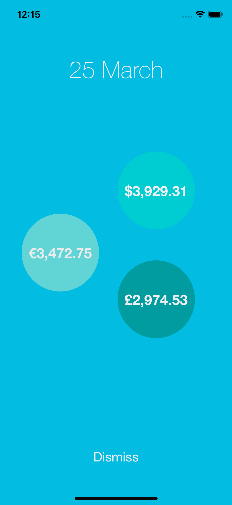

# BitcoinBolt

  
  

# Requirements

- Xcode 9 or later

# Compatability

- Requires iOS 11.0 or later.

# Usage

Clone the github repository and open the `BitcoinBolt.xcodeproj` file and hit run.

# Technical Considerations

To improve the user experience, all of the date required is loaded on app load. This means that the historical data for all currencies are fetched so that any date can be clicked and the information will immediately be available. This cuts down on fetching and parsing the information later.

The app architecture is centered around the Singleton pattern which creates a store that holds all of the data. Using this pattern provides a means of expanding the app in the future while not introducing too much complexity too early in the development process.

## Future improvements
- Caching
- More robust error handling
- More Testing!
- Some animations to improve the user experience

